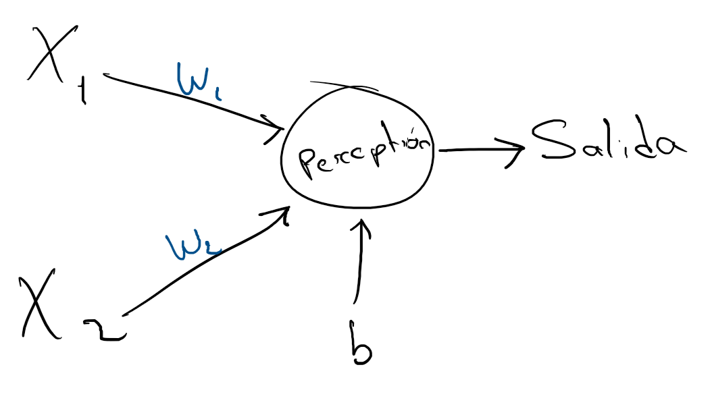
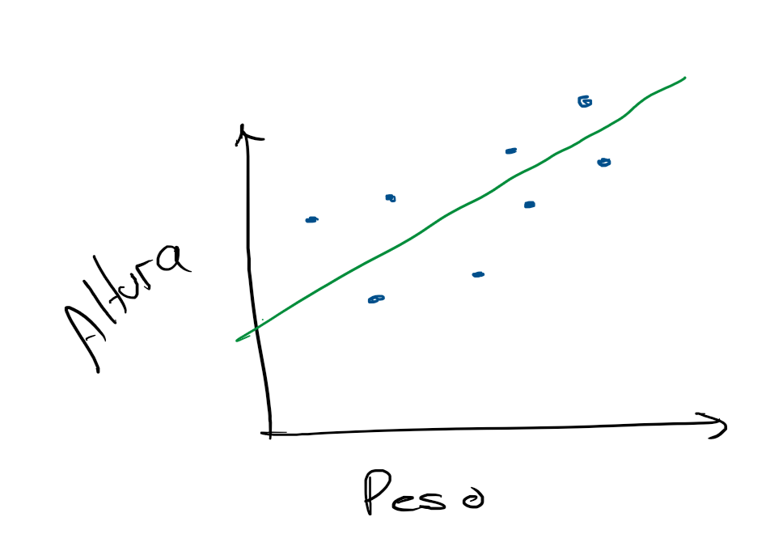

# Operadores Aritméticos

Imagina que estás desarrollando un sistema que puede predecir si un estudiante pasará un examen o no, dependiendo de sus notas y otros factores. Para esto, necesitas algo llamado Perceptrón, que es un modelo matemático simple utilizado en aprendizaje automático. Pero antes de llegar a eso, tenemos que entender cómo hacer algunas operaciones matemáticas básicas con los operadores aritméticos.

En python, los operadores aritméticos te permiten realizar sumas, restas, multiplicaciones, divisiones y otras operaciones matemáticas. A continuación, te mostramos los operadores aritméticos más comunes:

- `+` Suma
- `-` Resta
- `*` Multiplicación
- `/` División
- `//` División entera
- `%` Módulo (el residuo de la división)
- `**` Exponente

Por ejemplo, si tenemos dos números `a` y `b`, podemos hacer las siguientes operaciones

```python
a = 5
b = 3

print(a + b)  # Suma: 8
print(a - b)  # Resta: 2
print(a * b)  # Multiplicación: 15
print(a / b)  # División: 1.6666666666666667
print(a // b) # División entera: 1
print(a % b)  # Módulo (resto): 2
print(a ** b) # Potencia: 125
```

También podemos almacenar el resultado de una operación en una variable:

```python
suma = a + b
print(resultado) # 8
```

Nota. Lo aparece después del símbolo `#` es un comentario. Los comentarios son útiles para explicar el código y hacerlo más legible. (No se ejecutan)

## Ejemplo: Perceptrón



Un Perceptrón es un modelo de aprendizaje automático. Su objetivo es hacer una predicción basada en ciertas características (entradas). En nuestro caso, tomaremos dos entradas $x_1$ y $x_2$ y las multiplicaremos por dos pesos $w_1$ y $w_2$ y sumaremos un umbral o sesgo $b$. Esto nos da la salida del perceptrón, que nos ayuda a predecir algo.

$$salida = x_1 * w_1 + x_2 * w_2 + b$$

Donde:
- $x_1$ y $x_2$ son las entradas
- $w_1$ y $w_2$ son los pesos que dan importancia a cada entrada.
- $b$ es el sesgo que ajusta la predicción.

Veamos cómo se implementa este perceptrón en Python:

```python
# Pedimos las entradas al usuario
x1 = float(input("Ingresa el valor de x1: "))  # Calificación del primer examen
x2 = float(input("Ingresa el valor de x2: "))  # Calificación del segundo examen

# Definimos los pesos y el sesgo (esto lo puedes modificar según tu modelo)
w1 = 0.5
w2 = 0.7
b = -1.0

# Calculamos la salida del perceptrón
salida = (x1 * w1) + (x2 * w2) + b

# Mostramos el resultado
print(f"La salida del perceptrón es: {salida}")
```

En este ejemplo, el programa le pide al usuario que ingrese dos calificaciones, que representan las entradas del perceptrón. Luego, calcula la salida del perceptrón utilizando los pesos y el sesgo definidos. Finalmente, muestra la salida en pantalla.

En clases posteriores mostraremos el proceso de entramiento de un perceptrón, y cómo se puede ajustar los pesos y el sesgo para hacer mejores predicciones.

## Ejemplo: Regresión Lineal



La regresión lineal es otro concepto importante en ciencia de datos. Básicamente, busca una relación lineal entre una variable independiente $x$ y una dependiente $y$. Es decir, tratamos de encontrar la recta que mejor se ajusta a un conjunto de datos.

Imagina que tienes ciertos datos de ventas en función del tiempo, y quieres calcular la pendiente $m$ y la intersección $b$ de la recta que mejor se ajusta a esos datos. Para eso, usamos las fórmulas de la regresión lineal simple:

$$m = \frac{(n \cdot \sum{xy}) - (\sum{x} \cdot \sum{y})}{(n \cdot \sum{x^2}) - (\sum{x})^2}$$
 
$$b = \frac{(\sum{y} \cdot \sum{x^2}) - (\sum{x} \cdot \sum{xy})}{(n \cdot \sum{x^2}) - (\sum{x})^2} $$

Donde:
- $n$ es el número de datos
- $\sum{xy}$ es la suma de los productos de $x$ e $y$
- $\sum{x}$ es la suma de $x$
- $\sum{y}$ es la suma de $y$
- $\sum{x^2}$ es la suma de los cuadrados de $x$

Veamos cómo se implementa la regresión lineal en Python:

```python
# Datos proporcionados
suma_y = 114
suma_x_cuadrada = 300
suma_xy = 500
n = 30
suma_x_al_cuadrado = 350
suma_x = 110

# Calculamos el valor de b
numerador_b = ((suma_y * suma_x_cuadrada) - (suma_y * suma_xy))
denominador_b = ((n * suma_x_cuadrada) - suma_x_al_cuadrado)
b = numerador_b / denominador_b

# Calculamos el valor de m
m = ((n * suma_xy) - (suma_x * suma_y)) / ((n * suma_x_cuadrada) - suma_x_al_cuadrado)

# Mostramos los resultados
print(f"El valor de b es: {b}")
print(f"El valor de m es: {m}")
```

Predicción
Una vez que tenemos la pendiente $m$ y la intersección $b$, podemos hacer predicciones. Por ejemplo, si queremos predecir la altura de la persona en función de su edad, podemos hacerlo de la siguiente manera:

```python
# Pedimos la edad al usuario
edad = float(input("Ingresa tu edad: "))
altura = (m * edad) + b
print(f"Tu altura es: {altura}")
```

Ahora, puedes calcular la pendiente y la intersección de la recta que mejor se ajusta a tus datos. En este caso, los datos son ficticios, pero en la vida real, tendrás que recolectar datos reales y aplicar la regresión lineal para hacer predicciones.
