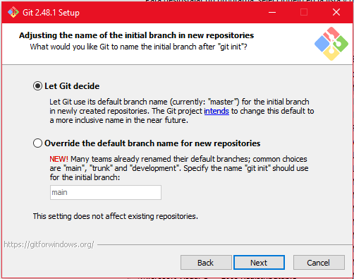

# Clase 2. Introducción a la linea de comandos

## Instalación de GIT

En caso de ser usuario de Windows es necesario contar con la Git Bash, puedes descargarla dando click [aquí](https://git-scm.com/downloads/win)

El proceso de instalación es bastante sencillo.

Cuando veas una pantalla como la siguiente, asegúrate de seleccionar la segunda opción (marcada en rojo). Para todo lo demás, puedes hacer clic en "Siguiente" sin problemas.



Para usuarios de Windows, abre Git Bash.
Para usuarios de Mac, abre la Terminal para continuar con el proceso.

## Comandos básicos.

A continuación, te mostramos algunos comandos básicos para interactuar con el sistema a través de la terminal

### 1. Saber ruta actual

Se utiliza en la terminal para mostrar el directorio actual en el que te encuentras trabajando.

```bash
pwd
```

Ejemplo de resultado:

```bash
C/Users/Jesus
```

Este resultado indica que estás dentro del directorio "Jesus" en la ruta `C/Users`


### 2.  Listar directorios y archivos

Este comando muestra los archivos y directorios en la ruta actual.

```bash
ls
```

### 3. Limpiar pantala

Este comando limpia la pantalla de la terminal, eliminando el historial visible de comandos anteriores.

```bash
clear
```

### 4. Cambiar de directorio

Este comando te permite cambiar de directorio dentro del sistema de archivos.

```bash
cd nombre_carpeta
```

Ejemplo:
```bash
cd Documents
```

Esto cambiará el directorio actual a la carpeta "Documents".

### 5. Crear un directorio.

Este comando crea un nuevo directorio (carpeta) en el directorio actual.

```bash
mkdir nombre_directorio
```

Ejemplo:

Esto crea una nueva carpeta llamada "Proyectos" en el directorio actual.


### 6. Volver al directorio anterior

Este comando te permite regresar al directorio padre del directorio actual. El doble punto (`..`) hace referencia al directorio superior.
```bash
cd ..
```

### 7. Crear un archivo 

Este comando crea un archivo vacío con el nombre y extensión especificados.

```bash
touch nombre.extension
```

Ejemplo:
```bash
touch hola.py
```

Esto crea un archivo python llamado `hola.py` en el directorio actual.

### 8. Eliminar un archivo

Este comando elimina un archivo en el directorio actual.

```bash
rm nombre.extension
```
Ejemplo:
```bash
rm saludo.txt
```
Esto elimina el archivo "saludo.txt" en el directorio actual.

### 9. Eliminar un directorio

Este comando elimina un directorio y todo su contenido de manera recursiva.

```bash
rm -r nombre_directorio
```
Ejemplo:
```bash
rm -r Proyectos
```
Esto elimina la carpeta "Proyectos" y todo su contenido, incluidos archivos y subdirectorios.

### 10. Mover o cambiar nombre de un archivo o directorio

El comando `mv` sirve tanto para mover archivos o directorios de una ubicación a otra, como para cambiarles el nombre.

Sintaxis para mover:

```bash
mv nombre_origen nombre_destino
```

Ejemplo:
```bash
mv hola.py /Users/Jesus/Proyectos/
```
Esto moverá el archivo hola.py a la carpeta Proyectos.

Sintaxis para cambiar el nombre de un archivo:

```bash
mv nombre_origen nombre_nuevo
```
Ejemplo:
```bash
mv hola.py hola_nuevo.py
```
Esto cambiará el nombre del archivo `hola.py` a `hola_nuevo.py`

### 11. Significado de `..` y `.`
- `..` se refiere al directorio padre del directorio actual.

Ejemplo:
```bash
cd ..
```

Esto te llevará al directorio padre del directorio actual.

Ejemplo 2:
```bash
cd ../nombre_carpeta
```
Esto te llevará a la carpeta `nombre_carpeta` dentro del directorio padre del directorio actual.

- `.` se refiere al directorio actual.

Ejemplo:
```bash
cd .
```
Esto no tendrá ningún efecto, ya que te mantendrá en el directorio actual.

Ejemplo 2:
```bash
cd ./nombre_carpeta
```
Esto te llevará a la carpeta `nombre_carpeta` dentro del directorio actual.

Ejemplo 3:
```bash
mv hola.py ./Proyectos/
```
Esto moverá el archivo `hola.py` a la carpeta `Proyectos` dentro del directorio actual.
