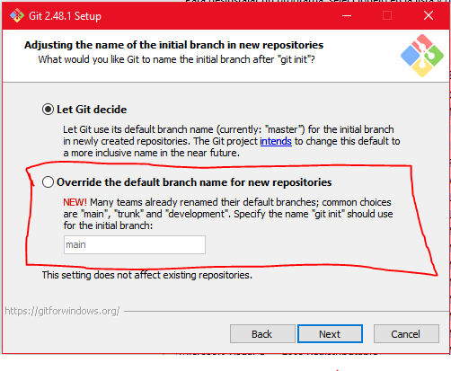

# Clase 2. Introducción a la linea de comandos

En caso de ser usuario de Windows es necesario contar con la Git Bash, puedes descargarla dando click [aquí](https://git-scm.com/downloads/win)

El proceso de instalación es bastante sencillo.

Cuando veas una pantalla como la siguiente, asegúrate de seleccionar la segunda opción (marcada en rojo). Para todo lo demás, puedes hacer clic en "Siguiente" sin problemas.

Para usuarios de Windows, abre Git Bash.
Para usuarios de Mac, abre la Terminal para continuar con el proceso.

